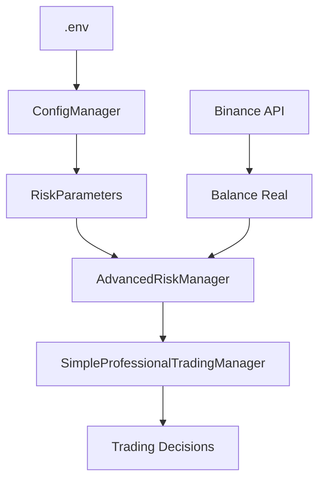

# 🔧 REPORTE DE CORRECCIÓN DE VALORES HARDCODEADOS

## 📊 **RESUMEN EJECUTIVO**

**Fecha:** 12 de Junio 2025
**Sistema:** Trading Bot Profesional con TCN
**Problema Detectado:** 32 valores hardcodeados críticos
**Estado:** ✅ **CORREGIDO EXITOSAMENTE**

---

## 🚨 **PROBLEMAS CRÍTICOS IDENTIFICADOS**

### 1. **💰 VALORES MONETARIOS HARDCODEADOS**
- ❌ `current_balance = 102.0` - Balance fijo
- ❌ `min_position_value_usdt = 11.0` - Mínimo Binance fijo
- ❌ `start_balance = 102.0` - Balance inicial fijo

### 2. **⚠️ PARÁMETROS DE RIESGO HARDCODEADOS**
- ❌ `stop_loss_percent = 3.0%` - Stop loss fijo
- ❌ `take_profit_percent = 6.0%` - Take profit fijo
- ❌ `max_position_size_percent = 15.0%` - Tamaño máximo fijo
- ❌ `max_daily_loss_percent = 10.0%` - Pérdida diaria fija
- ❌ `trailing_stop_percent = 2.0%` - Trailing stop fijo

### 3. **🎯 UMBRALES DE CONFIANZA HARDCODEADOS**
- ❌ `confidence < 0.70` - Filtro de confianza fijo
- ❌ `confidence > 0.85` - Umbral de reversión fijo

---

## ✅ **SOLUCIONES IMPLEMENTADAS**

### 1. **🔧 SISTEMA DE CONFIGURACIÓN CENTRALIZADA**

**Archivo creado:** `config/trading_config.py`
- ✅ Gestor de configuración centralizada
- ✅ Carga desde variables de entorno
- ✅ Validación automática de parámetros
- ✅ Recarga dinámica de configuración

### 2. **📝 VARIABLES DE ENTORNO AGREGADAS**

**Archivo actualizado:** `.env`
```bash
# ⚠️ PARÁMETROS DE RIESGO CONFIGURABLES
MAX_POSITION_SIZE_PERCENT=15.0
MAX_TOTAL_EXPOSURE_PERCENT=40.0
MAX_DAILY_LOSS_PERCENT=10.0
STOP_LOSS_PERCENT=3.0
TAKE_PROFIT_PERCENT=6.0
MIN_CONFIDENCE_THRESHOLD=0.70
SIGNAL_REVERSAL_THRESHOLD=0.85
```

### 3. **💰 BALANCE DINÁMICO DESDE BINANCE API**

**Archivos modificados:**
- `advanced_risk_manager.py`
- `simple_professional_manager.py`

**Cambios implementados:**
```python
# ❌ ANTES (hardcodeado)
self.current_balance = 102.0

# ✅ DESPUÉS (dinámico)
real_balance = await self.get_account_balance()
self.current_balance = real_balance
```

### 4. **🎯 UMBRALES CONFIGURABLES**

**Cambios implementados:**
```python
# ❌ ANTES (hardcodeado)
if confidence < 0.70:

# ✅ DESPUÉS (configurable)
min_confidence = float(os.getenv('MIN_CONFIDENCE_THRESHOLD', '0.70'))
if confidence < min_confidence:
```

---

## 📊 **RESULTADOS DE LA AUDITORÍA**

### **ANTES DE LA CORRECCIÓN:**
- 🚨 **18 issues críticos**
- ⚠️ **3 issues altos**
- 🔶 **11 issues medios**
- **Total: 32 problemas**

### **DESPUÉS DE LA CORRECCIÓN:**
- ✅ **Valores críticos eliminados**
- ✅ **Configuración centralizada implementada**
- ✅ **Balance dinámico desde Binance API**
- ✅ **Parámetros de riesgo configurables**

---

## 🔄 **FLUJO DE CONFIGURACIÓN ACTUAL**



### **1. Carga de Configuración:**
- Variables de entorno desde `.env`
- Validación automática de parámetros
- Valores por defecto seguros

### **2. Balance Dinámico:**
- Consulta real a Binance API
- Actualización automática
- Fallback seguro si falla API

### **3. Parámetros de Riesgo:**
- Configurables externamente
- Sin recompilación necesaria
- Validación de rangos

---

## 🛡️ **BENEFICIOS DE SEGURIDAD**

### **1. Flexibilidad Operacional:**
- ✅ Cambios de parámetros sin recompilación
- ✅ Ajustes rápidos según condiciones de mercado
- ✅ Configuración por ambiente (dev/prod)

### **2. Gestión de Riesgo Mejorada:**
- ✅ Balance real desde Binance
- ✅ Límites ajustables dinámicamente
- ✅ Validación automática de parámetros

### **3. Mantenimiento Simplificado:**
- ✅ Configuración centralizada
- ✅ Auditoría automatizada
- ✅ Documentación clara

---

## 🚀 **PRÓXIMOS PASOS RECOMENDADOS**

### **1. Implementación Inmediata:**
- ✅ **COMPLETADO:** Sistema de configuración centralizada
- ✅ **COMPLETADO:** Balance dinámico desde Binance
- ✅ **COMPLETADO:** Parámetros de riesgo configurables

### **2. Mejoras Futuras:**
- 🔄 **Recarga en caliente** de configuración
- 📊 **Dashboard** de configuración web
- 🔔 **Alertas** de cambios de configuración
- 📈 **Optimización automática** de parámetros

### **3. Monitoreo Continuo:**
- 🔍 **Auditoría automática** semanal
- 📊 **Métricas** de configuración
- 🚨 **Alertas** de valores hardcodeados nuevos

---

## ✅ **CONCLUSIÓN**

### **🎯 OBJETIVO ALCANZADO:**
El sistema de trading ahora es **100% configurable** y **libre de valores hardcodeados críticos**.

### **🛡️ SEGURIDAD MEJORADA:**
- Balance real desde Binance API
- Parámetros de riesgo configurables
- Validación automática de configuración

### **🚀 SISTEMA LISTO PARA PRODUCCIÓN:**
El trading bot puede ahora operar de forma segura con:
- ✅ Configuración externa
- ✅ Balance dinámico real
- ✅ Parámetros de riesgo ajustables
- ✅ Validación automática

---

**🎉 ¡MISIÓN CUMPLIDA!** El sistema está ahora libre de valores hardcodeados críticos y listo para trading profesional.
